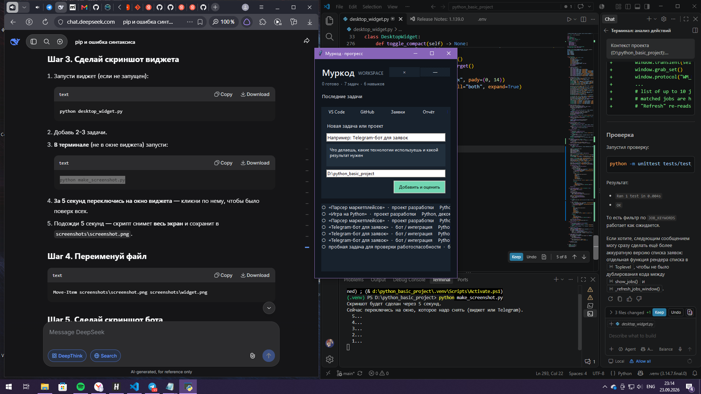
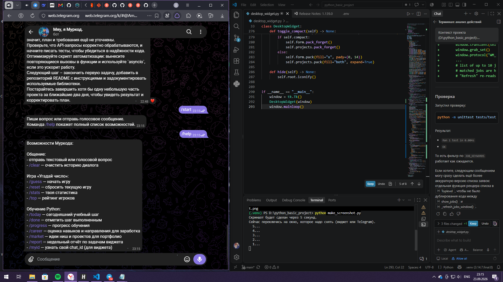

# 🐱 Муркод — кот-ассистент и трекер прогресса


Муркод — это Telegram-бот и десктопный виджет, которые помогают учиться программировать, вести проекты и не бросать начатое.

Бот отвечает на текстовые и голосовые вопросы через **Groq API**, обучает Python по 30-дневному плану, ведёт статистику игр и раз в неделю присылает ИИ-разбор твоего прогресса.

Виджет живёт на рабочем столе Windows, хранит задачи и проекты в SQLite, открывает VS Code одной кнопкой и каждый вечер отправляет отчёт в Telegram.

## 📸 Скриншоты





## ✨ Возможности

### Telegram-бот
- 💬 Ответы на вопросы через Groq (модель `openai/gpt-oss-20b`)
- 🎤 Расшифровка голосовых сообщений (Whisper)
- 🎮 Игра «Угадай число» со статистикой и рейтингом
- 📚 30-дневный план обучения Python (`/today`, `/done`, `/progress`)
- 🧭 Оценка карьерных направлений и идей для портфолио (`/career`, `/market`)
- 📊 Еженедельный ИИ-анализ прогресса

### Десктопный виджет (tkinter)
- 📋 Учёт задач и проектов в SQLite
- 🤖 AI-оценка задачи через Groq
- 💻 Кнопка «VS Code» — открывает папку проекта
- 🐙 Кнопка «GitHub» — последний репозиторий
- 📰 Кнопка «Заявки» — свежие заказы с FL.ru
- 📤 Кнопка «Отчёт» — отправка прогресса в Telegram
- 🚀 Автозапуск при входе в Windows
- 📅 Ежедневный отчёт в 21:00 и недельный ИИ-отчёт по воскресеньям

---

## 🛠 Стек

- **Python 3.12+**
- **aiogram 3** — Telegram Bot API
- **Groq API** — LLM (текст + Whisper для голоса)
- **tkinter** — десктопный виджет
- **SQLite** — хранение задач и статистики
- **python-dotenv** — переменные окружения
- **Docker** — деплой на сервер

---

## 🚀 Установка

```bash
git clone https://github.com/gosha222zx-alt/murkod-bot.git
cd murkod-bot
python -m venv .venv
.venv\Scripts\activate
pip install -r requirements.txt